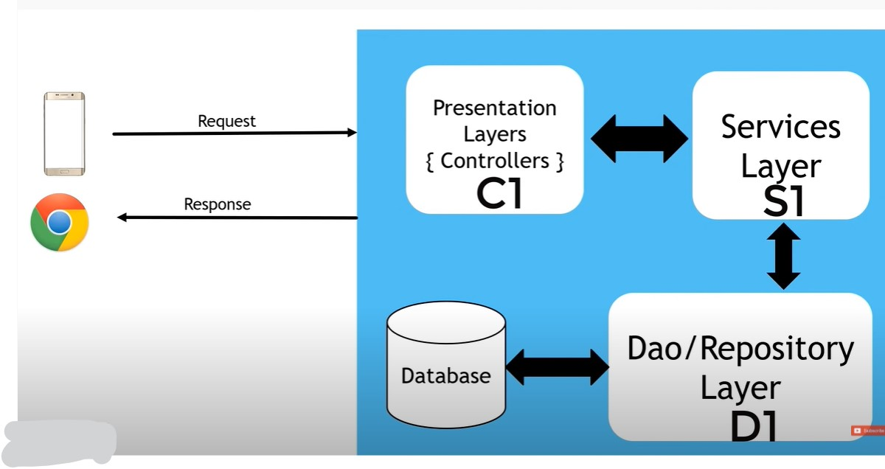
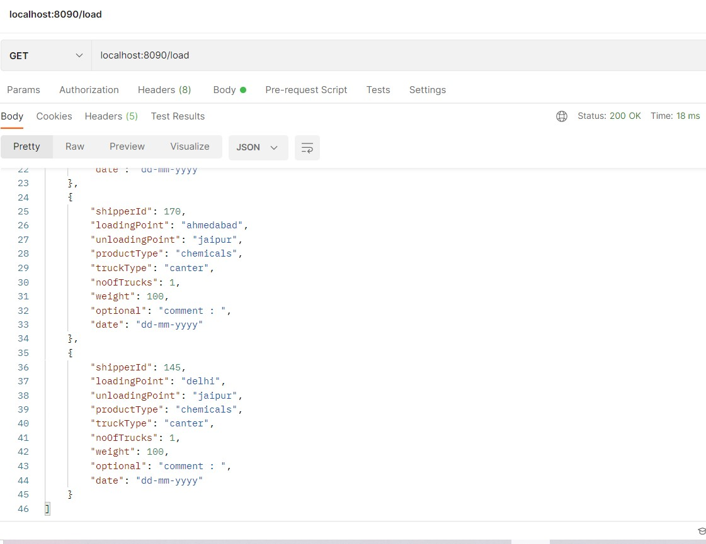
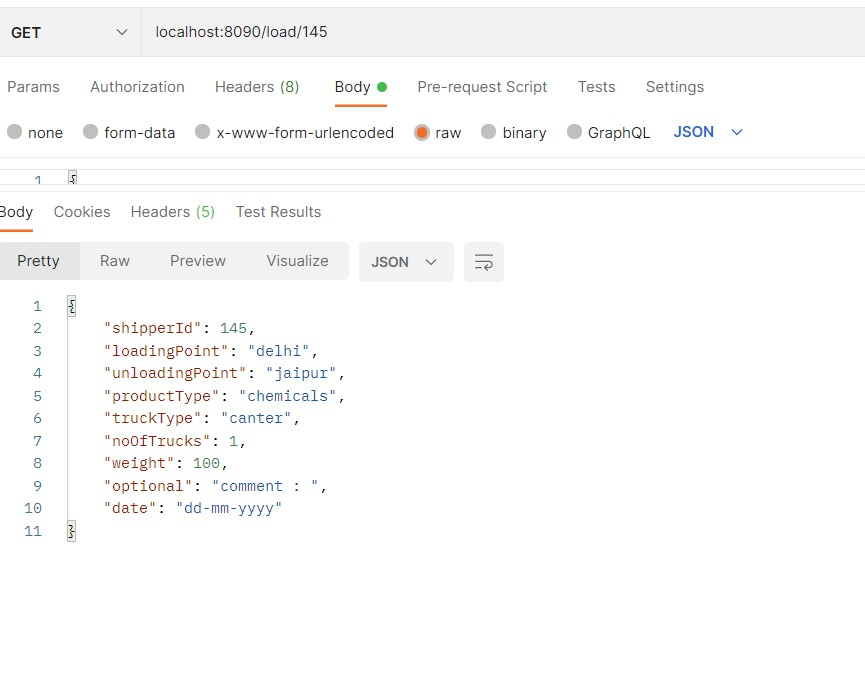
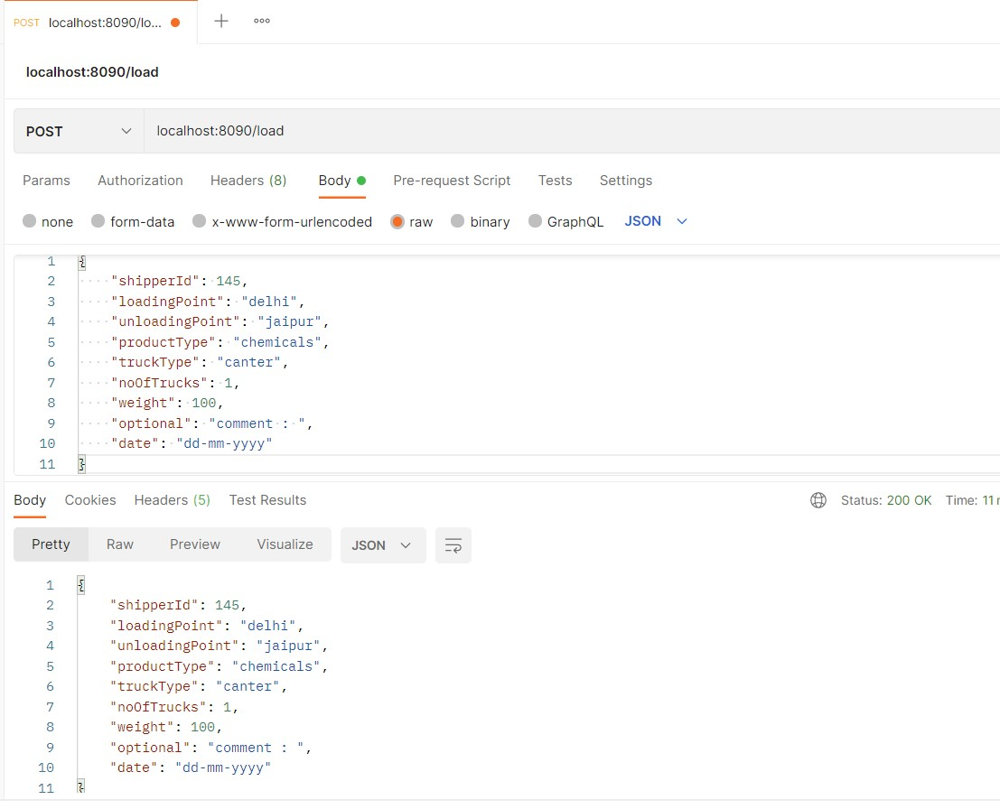
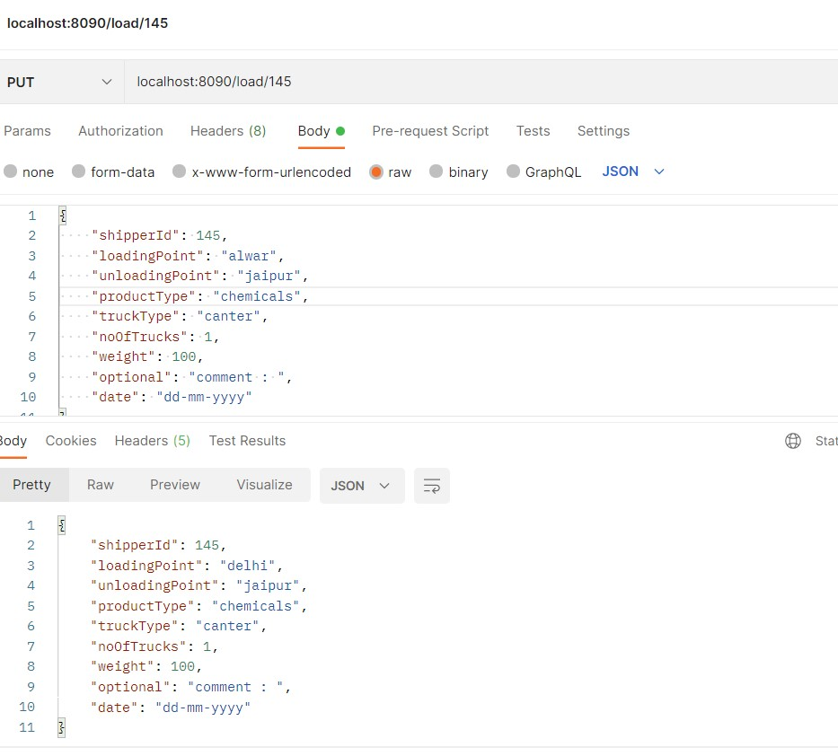
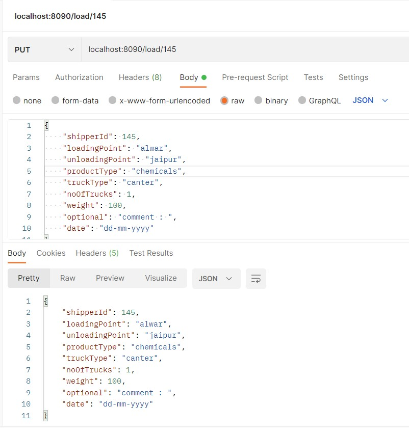
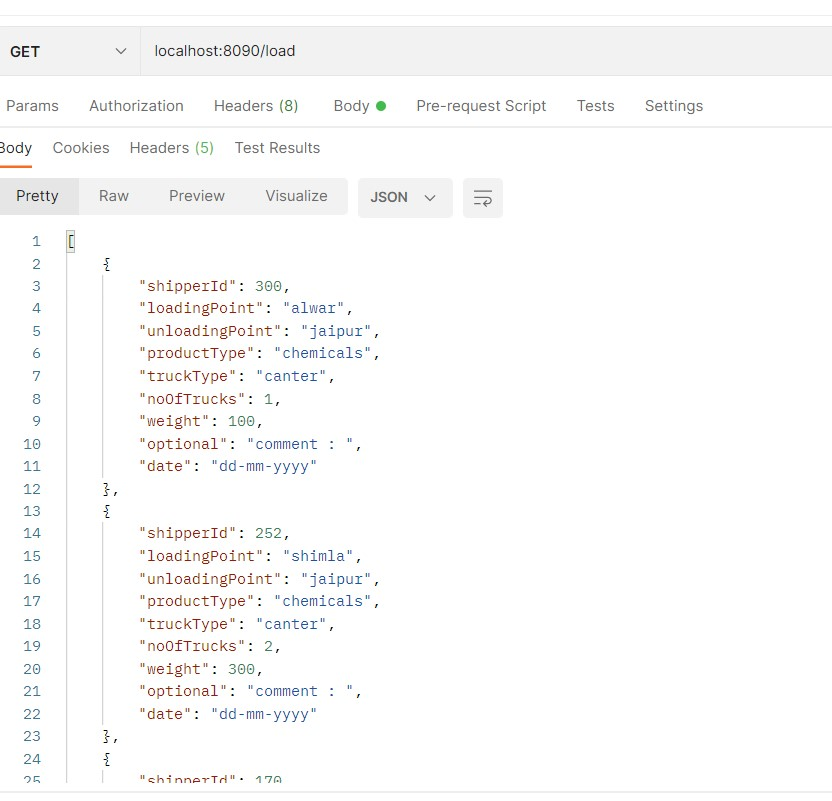
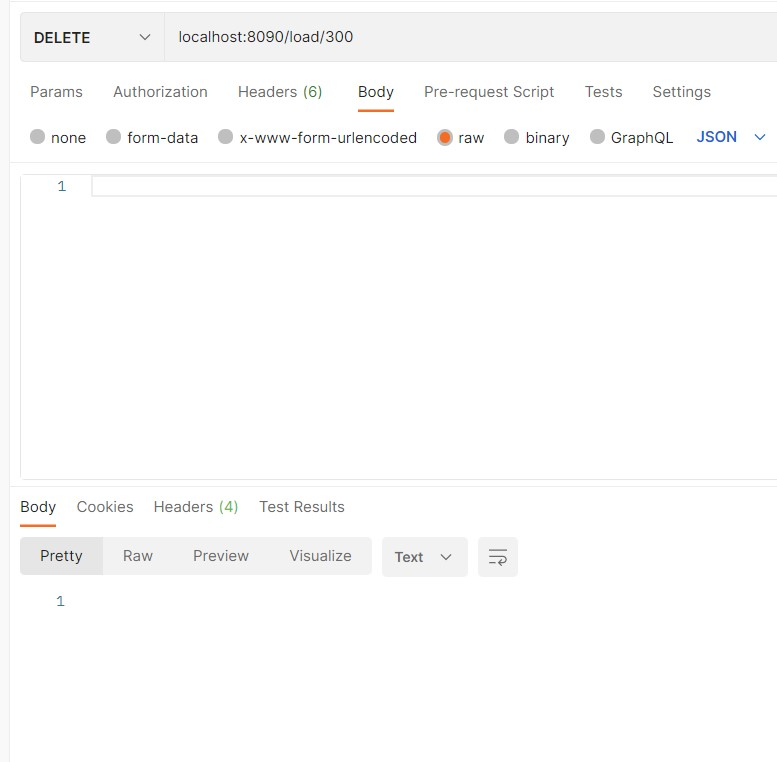
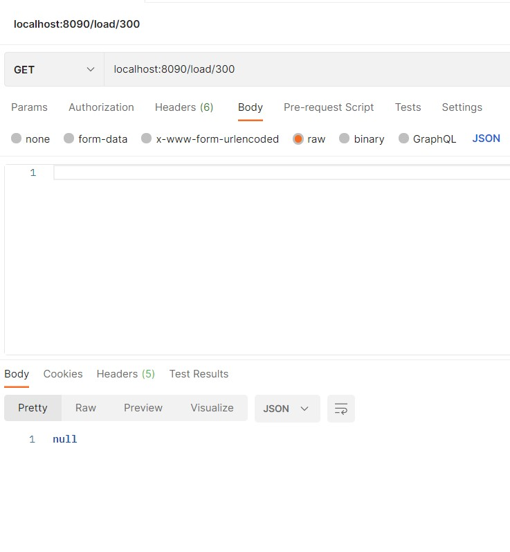
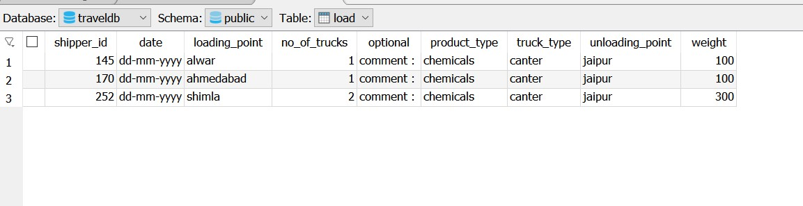

## REST API using Spring Boot
**REST API** generates the HTTP request that performs CRUD operations on the data, this will seperate frontend from the server, which helps application be loosely coupled.
Usually, REST API returns data in JSON or XML format.

### `J2EE Architecture`

### `GET load Request` 

### `GET load Request with shipperId`

### `POST Request`

### `Before Sending PUT Request`

### `After sending PUT Request`

### `Before DELETING load with shipperId 300`

### `While DELETING load with shipperId 300`

### `After DELETING load with shipperId 300`

### `Database traveldb after all the operations`

